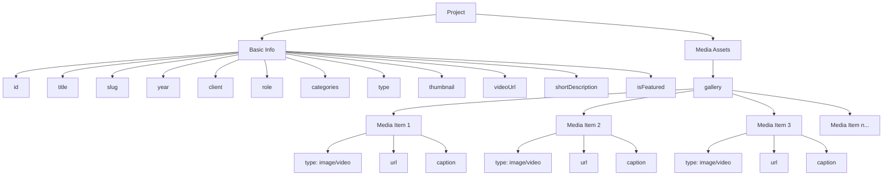
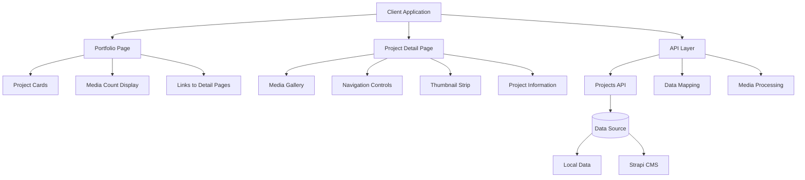
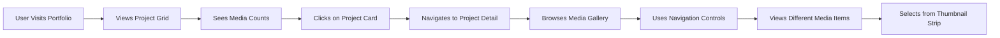
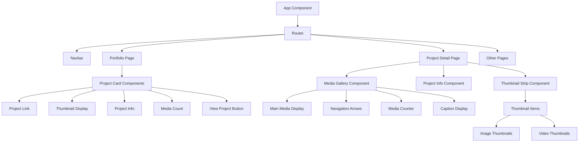

# Visual Project Structure

## Portfolio Item Structure Diagram



## Application Architecture Diagram



## File Structure Tree

```
d:\iadithkrishna\
├── ak-portfolio-cms\
│   └── src\
│       └── api\
│           └── project\
│               └── content-types\
│                   └── project\
│                       └── schema.json (modified)
│
├── client\
│   └── src\
│       ├── api\
│       │   └── projectsApi.js (modified)
│       ├── components\
│       │   ├── Navbar.js (unchanged)
│       │   └── Navbar.css (unchanged)
│       ├── data\
│       │   └── projects.js (modified)
│       ├── pages\
│       │   ├── Portfolio.jsx (modified)
│       │   ├── ProjectDetail.jsx (new)
│       │   ├── Home.jsx (unchanged)
│       │   ├── About.jsx (unchanged)
│       │   └── Journeys.jsx (unchanged)
│       ├── App.js (modified)
│       └── App.css (modified)
│
├── PROJECT_STRUCTURE.md (new documentation)
├── SUMMARY_OF_CHANGES.md (new documentation)
└── VISUAL_PROJECT_STRUCTURE.md (this file)
```

## User Flow Diagram



## Component Relationship Diagram

